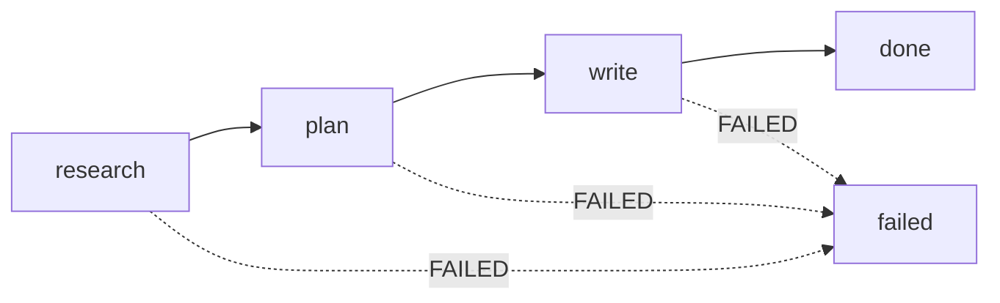

# Architecture

Odyssey is a durable, typed [Hyperchart](https://github.com/surprisal/pi-hyperchart) statechart that turns a single prompt into an evidence-led, self-contained interactive HTML report. The whole engine is one chart (`chart.ts`, ~86 states) plus 14 agent definitions, a set of deterministic TypeScript scripts and guards, shared Zod contracts, and a deterministic renderer.

## The pipeline at a glance

| Stage | Question it answers | Output |
| --- | --- | --- |
| `research` | What is true and citable about this topic? | Immutable evidence index (`artifacts/research/evidence-index.json`) |
| `plan` | What story do we tell, in what order, backed by which evidence? | Verified report plan + global experience plan |
| `write` | What does the reader actually see? | `artifacts/report.html` |

Each stage is a compound state; `FAILED` from any stage bubbles to the chart-level `failed` final state. The detailed state-by-state walkthrough is in [pipeline.md](pipeline.md).

## Design principles

**1. Agents emit typed JSON, never markup.** No agent produces HTML, CSS, JavaScript, or raw ECharts options. Agents write JSON artifacts validated by Zod contracts; the deterministic renderer (`engine/`) is the only component that produces HTML. This is both a safety boundary (no injected markup from web research) and a quality boundary (layout bugs are renderer bugs, fixable once).

**2. Deterministic core, agentic edges.** Anything that can be computed is a script: assembling indices, building work packets, routing, enforcing budgets, applying patches, rendering, screenshotting. Agents are reserved for judgment — researching, planning, reviewing, writing. If a state's decision can be expressed as code, it is code; scripts don't hallucinate and cost nothing to rerun.

**3. Layered validation with actionable feedback.** Every agent artifact passes through up to four layers: Zod structural contracts, deterministic cross-artifact guards, semantic agent gates, and deterministic loop budgets. Guards report *every* violation at once and name the exact field to change — a guard message is an instruction to the retrying agent, and a vague or misleading message sends the retry loop in the wrong direction. See [contracts-and-guards.md](contracts-and-guards.md).

**4. Immutable, content-addressed evidence.** `assemble-evidence` merges all deep-research takes into one evidence index with content-hashed IDs (`s_<hash>` for sources keyed by normalized URL, `e_<hash>` for evidence keyed by claim + sources). From that point on, every beat, chapter plan, visual request, and prose module references evidence by ID, and guards enforce referential integrity end-to-end. Downstream states may annotate the register through bounded patches but never mutate claims or IDs.

**5. Every loop is bounded; failure modes are explicit.** Each quality loop has a deterministic budget script, so no gate can spin forever. Where correctness is at stake the pipeline fails closed (`planning-invalid`, `closure-blocked` — the run stops rather than shipping an unsound plan). Where polish is at stake it finishes with recorded warnings (`done-with-warnings` + `visual-qa-warnings.json` — a readable report with known blemishes beats no report).

**6. Fresh, minimal context per agent call.** All agents run with `defaultContext: fresh`, replaced system prompts, and no inherited project context. Fan-out states embed exactly the data one work item needs — beat verifiers get a compact per-beat evidence packet, visual researchers get a per-request packet with only the relevant evidence and source records. Small contexts keep the fan-out cheap and focused, and remove cross-item interference.

**7. Parallel by default.** Initial research fans out three angles; deep research maps over takes (concurrency 6); section beat drafting maps over sections (5); beat verification maps over beats (8) *in parallel with* the global layout plan; chapter production maps over chapters (5); visual acquisition maps over requests (3 per chapter). Sequencing exists only where a real data dependency exists.

**8. Durable execution.** The Hyperchart runtime persists every completion to a durable log, so a run survives process restarts and resumes exactly where it stopped. Infrastructure failures (network outage, session limits) are recovered by rewinding the log past the failure and resuming — see [running.md](running.md#failure-and-recovery).

## Repository layout

| Path | Contents |
| --- | --- |
| `chart.ts` | The complete `research → plan → write` Hyperchart. |
| `agents/` | 14 agent definitions with symbolic `role`/`toolset` frontmatter ([agents.md](agents.md)). |
| `contracts/` | Shared Zod schemas, registered runtime contracts, depth/polish caps, parsing helpers. |
| `guards/` | Deterministic validation guards run as `validate` scripts. |
| `scripts/` | Deterministic assembly, routing, budget, packet, patch, and screenshot scripts. |
| `engine/` | Typed render model + self-contained HTML renderer ([renderer.md](renderer.md)). |
| `tests/` | Contract-coverage, contract, renderer, Playwright, and workflow-fixture tests. |
| `examples/eink/` | A typed example `ReportDocument` and its rendered HTML. |
| `artifacts/` | Run output (gitignored working directory of a chart run). |
