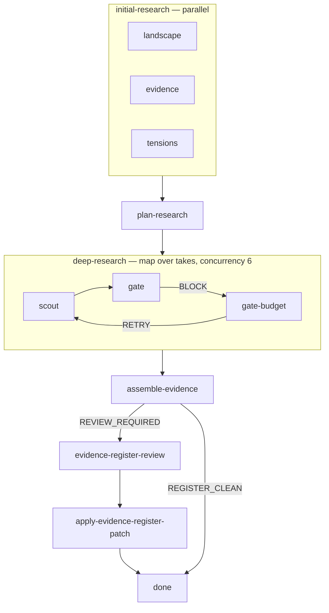
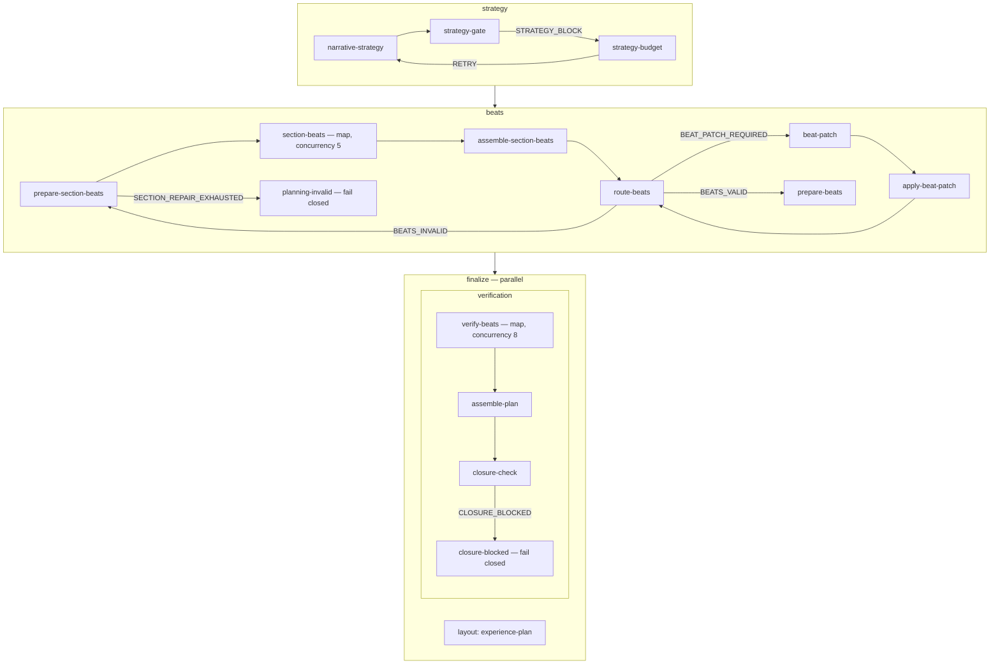
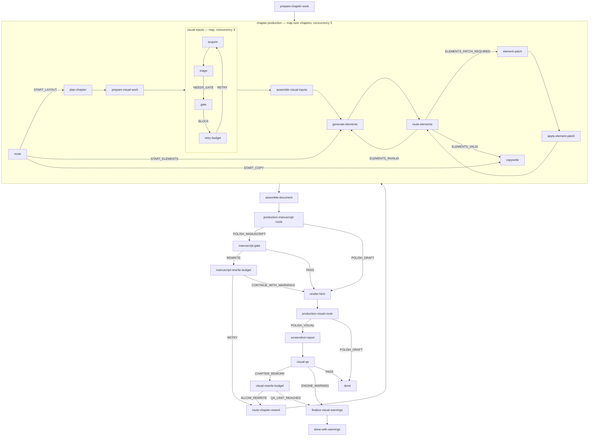

# Pipeline reference

State-by-state walkthrough of `chart.ts`. Args: `prompt` (the report request), `evidenceDepth` (`skim | standard | deep`), `productionPolish` (`draft | report | release`); both knobs are explained with their exact caps in [running.md](running.md#arguments).

Conventions used below:

- **agent** states run one of the [agent definitions](agents.md) in a fresh session; **script** states run a deterministic TypeScript file under `scripts/` or `engine/`.
- **validate** is a deterministic guard from `guards/` that runs after the action; on rejection the state retries (`resume` continues the same session with the guard feedback, `restart` starts a new one). When retries are exhausted the state emits the durable `FAILED` event, which bubbles to the chart's `failed` final state.
- Loop budgets are ordinary script states; they decide between "retry with feedback" and "proceed/fallback with a recorded warning".

## Stage 1: `research`

| State | Action | Validate / budget | What it does |
| --- | --- | --- | --- |
| `initial-research.{landscape,evidence,tensions}` | agent `research-scout` ×3 in parallel | — | Bounded context scans from three fixed angles: landscape (definitions, actors, timeline), evidence (facts, mechanisms, primary data), tensions (disagreement, risks, open questions). No deep dives, no outline. |
| `plan-research` | agent `planner` | `validate-depth-agenda`, resume, 2 retries | Reads all three scans; writes a provisional **narrative skeleton** (thesis, reader question, ordered beats, coverage tags) and a **deep-research agenda** of takes that close the skeleton's coverage gaps. Take count and per-take budgets are capped by `evidenceDepth`. |
| `deep-research.scout` | agent `research-scout` (map, concurrency 6) | `validate-take`, resume, 2 retries | Researches one take into a versioned artifact `artifacts/research/deep/<takeId>/research-<attempt>.json`, hard-capped by depth (sources/findings per take). On gate re-entry it preserves accepted findings and addresses only the gate delta, staying within the caps. |
| `deep-research.gate` | agent `research-gate` | — | Semantic gate over the one supplied artifact. `PASS`, or `BLOCK` with the smallest missing-evidence delta. |
| `deep-research.gate-budget` | script `loop-budget` (LIMIT 2) | — | Allows two gate-driven rework rounds per take; the third artifact proceeds regardless, with the exhaustion reason recorded in the feedback. |
| `assemble-evidence` | script `assemble-evidence` | — | Deterministically merges all takes into the immutable **evidence index**: URL-normalized, content-hashed source IDs (`s_…`), claim-hashed evidence IDs (`e_…`), deduped with merged tags/takeIds, plus contradictions (`c_…`), gaps, and blockers. Emits `REVIEW_REQUIRED` only when polish ≠ `draft` **and** unresolved contradictions/blockers exist; otherwise `REGISTER_CLEAN`. |
| `evidence-register-review` | agent `planner` | `validate-evidence-register-patch`, resume, 2 retries | Reviews unresolved register entries and emits a bounded patch (≤ 8 operations, status/rationale/evidenceIds only, IDs and descriptions immutable; `[]` when no safe change is justified). |
| `apply-evidence-register-patch` | script | — | Deterministically applies the patch back onto `evidence-index.json`. |

## Stage 2: `plan`

### `strategy`

| State | Action | Validate / budget | What it does |
| --- | --- | --- | --- |
| `narrative-strategy` | agent `planner` | `validate-strategy`, resume, 2 retries | Reads the evidence index and defines one supportable thesis, reader question, ordered sections, evidence allocation, exclusions, and style notes. No beats, no prose. Versioned artifact `artifacts/plan/strategy-<attempt>.json`. |
| `strategy-gate` | agent `plan-gate` | — | Semantic review of the strategy against the evidence index; `STRATEGY_PASS` or `STRATEGY_BLOCK` with `{reason, instructions}`. |
| `strategy-budget` | script `loop-budget` (LIMIT 2) | — | Two gate-driven revisions, then proceed with the current strategy. |

### `beats`

Beat planning maintains a single **stable candidate** (`artifacts/plan/beats-candidate.json`) that is generated and repaired section-by-section in parallel, then routed through a deterministic triage:

| State | Action | Validate / budget | What it does |
| --- | --- | --- | --- |
| `prepare-section-beats` | script | budget: 2 repair rounds (`MAX_VISITS 3`) | Splits the strategy into per-section work items. On repair passes it embeds the routing feedback and the current candidate; after two repair rounds it emits `SECTION_REPAIR_EXHAUSTED` → `planning-invalid`. |
| `section-beats.generate` | agent `section-beat-planner` (map, concurrency 5) | `validate-section-beats`, resume, 2 retries | Generates or repairs exactly one section's beats. In repair mode it preserves every unaffected beat. |
| `assemble-section-beats` | script | — | Deterministically merges the section drafts into the stable candidate (plus a versioned snapshot). |
| `route-beats` | script | micro-patch budget: 2 rounds (`ROUTE_VISIT ≥ 3` fails the candidate) | Full topology triage: structural problems (empty sections, unknown sections, unknown beat dependencies, dependency cycles) → `BEATS_INVALID` back to section repair; dangling evidence IDs only → `BEAT_PATCH_REQUIRED`; clean → `BEATS_VALID`. |
| `beat-patch` → `apply-beat-patch` | agent `planner` + script | — | Bounded evidence-ID micro-patch on the candidate (beat identity and dependencies untouched), applied deterministically, then re-routed. |
| `prepare-beats` | script | — | Freezes the candidate into per-beat work items and compact **evidence packets** (`beat-packets-<n>/`) for verification. |
| `planning-invalid` | script `fail-closed` | — | Deliberate dead end: emits `FAILED` with the routing reason. A structurally unsound plan is never shipped. |

### `finalize` (parallel)

Verification and global layout have no data dependency, so they run concurrently — verification of dozens of beats typically hides entirely behind the single global layout call.

| State | Action | Validate / budget | What it does |
| --- | --- | --- | --- |
| `verification.verify-beats.verify` | agent `beat-verifier` (map, concurrency 8) | `validate-verified-beat`, restart, 2 retries | Verifies one frozen beat against its evidence packet only; writes a verdict `{id, verdict: supported|weakened|unsupported, evidenceIds, confidence, caveat, notes}`. Beat fields are merged deterministically later, so the verifier never restates them. |
| `verification.assemble-plan` | script | — | Merges verdicts + frozen beats + strategy into the **report plan**. |
| `verification.closure-check` | script | — | Deterministic closure audit of the plan against the evidence index; `CLOSURE_VALID` or `CLOSURE_BLOCKED` → fail closed. |
| `layout.experience-plan` | agent `layout-planner` | `validate-experience`, restart, 2 retries | The one global editorial/visual pass: prose-vs-visual allocation, chapter rhythm, visual budgets, beat presentation roles, high-level visual intent. Concrete visual requests are deliberately left to per-chapter planners. |

## Stage 3: `write`

### Chapter production

`prepare-chapter-work` builds one self-contained work item per section — the section's verified beats plus exactly the evidence and source records they reference, the experience-plan section, block budget, and the four chapter file paths (`chapter-plan.json`, `visual-inputs.json`, `elements.json`, `chapter.json` under `artifacts/write/chapters/<sectionId>/`). Chapters then run through the map independently.

The `route` script is the rework entry point: fresh chapters (and rework owned by `layout`) start at `plan-chapter`; rework owned by `elements` starts at `generate-elements`; rework owned by `copy` starts at `copywrite`. On rework the agents patch their previous artifacts in place instead of regenerating.

| State | Action | Validate / budget | What it does |
| --- | --- | --- | --- |
| `plan-chapter` | agent `chapter-planner` | `validate-chapter-plan`, resume, 2 retries | Plans one atomic chapter strictly within its work item: every verified beat declares `inline` or `dataset-backed` mode and `guaranteedUse: true`; visual requests exist only for dataset-backed intents, each with `required: true`, one beat, existing evidence IDs, and a declared fallback; the chapter budget is enforced *before* acquisition. |
| `prepare-visual-work` | script | — | Builds one packet per dataset-backed request (request + its evidence and source records). |
| `visual-inputs.acquire` | agent `visual-researcher` (map, concurrency 3) | `validate-visual-input` (0 in-state retries — the loop budget owns retrying) | Lazily acquires exactly one input, starting from the packet's source URLs. Output `sourceIds` may contain only `s_`-prefixed source IDs; evidence IDs live only in `dataset.provenance[].evidenceId`. |
| `visual-inputs.triage` | script | — | Usable input → semantic gate; `not-found` → fallback path, done. |
| `visual-inputs.gate` | agent `visual-gate` | — | Reviews the acquired input against the request: `PASS`, `FALLBACK`, or `BLOCK` with a minimal acquisition delta. |
| `visual-inputs.retry-budget` | script (MAX 2 attempts) | — | One more acquisition attempt with combined guard + gate feedback; after that it deterministically writes a `not-found` input carrying the request's declared fallback, so element generation always has a complete catalog. |
| `assemble-visual-inputs` | script | — | Merges the chapter's inputs into its visual catalog. |
| `generate-elements` | agent `element-generator` | — (validated by `route-elements`) | Produces the chapter's typed block package from the plan + catalog. Dataset/image-backed plus fallback blocks must fit the experience visual budget; total blocks must fit `maxBlocks`; a dataset with no valid chart binding becomes a table block. |
| `route-elements` | script (via `guards/element-checks.ts`) | budget: attempt ≥ 2 adds degrade-gracefully instructions | Aggregated deterministic triage of the package: fully valid → `copywrite`; fixable by a bounded fallback patch → `element-patch`; otherwise regenerate with the full violation list. |
| `element-patch` → `apply-element-patch` | agent `element-generator` + script | patch paths restricted to `^/blocks/(-|N)(/fallbackRequestId)?$` | Adds one renderer-valid fallback block or sets `fallbackRequestId` on an existing block; everything else is untouchable by construction. |
| `copywrite` | agent `copywriter` | `validate-chapter`, resume, 2 retries | One prose module per verified beat, leading into and interpreting the visuals, preserving evidence IDs and caveats. |

### Manuscript loop, render, visual QA

| State | Action | Validate / budget | What it does |
| --- | --- | --- | --- |
| `assemble-document` | script | — | Merges plan, evidence, experience, and all chapter packages into the single `ReportDocument`. |
| `production-manuscript-route` | script | — | `draft` skips straight to render; otherwise the manuscript gate runs. |
| `manuscript-gate` | agent `manuscript-gate` | — | The only whole-manuscript review: progression, rhythm, repetition, transitions, evidence-backed copy, visual composition. `PASS` (perfection not required) or `REWRITE` with per-chapter corrections, each owned by `layout`, `elements`, or `copy`. |
| `manuscript-rewrite-budget` | script | `chapterRewriteCap`: report 2, release 3 | Within budget → `route-chapter-rework`; exhausted → render with recorded warnings. |
| `route-chapter-rework` | script | — | Builds rework items only for the named real chapters, attaching owner + instructions, and re-enters `chapter-production` (which routes each chapter to the owning stage). |
| `render-html` | script `engine/render-report.ts` | `validate-render` (0 retries — renderer failures are engine bugs) | Deterministic render to self-contained `artifacts/report.html` plus a machine-readable render review; validation writes `render-validation.json`. |
| `production-visual-route` | script | — | `draft` finishes here; otherwise screenshot QA runs. |
| `screenshot-report` | script (Playwright) | — | Desktop + mobile tile screenshots with a manifest. |
| `visual-qa` | agent `visual-qa` | — | Screenshot-only review: real metric values, defined axes/labels, readable tables, no clipping, legible mobile tiles. `PASS`; `CHAPTER_REWORK` for real chapter defects; `ENGINE_WARNING` for renderer-level/global issues (never routed to chapters). |
| `visual-rewrite-budget` | script | `visualQaPasses`: report 1, release 2 | Within budget → chapter rework loop; exhausted → warnings. |
| `finalize-visual-warnings` | script | — | Persists outstanding QA findings to `visual-qa-warnings.json` and finishes at `done-with-warnings`. |

## Failure semantics

- **Guard-exhausted states** (retries used up) emit durable `FAILED`; each stage compound forwards `FAILED` to the chart's `failed` final state.
- **Fail-closed states** — `plan.beats.planning-invalid` and `plan.finalize.verification.closure-blocked` — end the run on purpose: an unsound beat topology or an unclosed plan must not reach production.
- **Finish-with-warnings paths** — manuscript budget exhaustion and visual QA limits — ship the report and record what was left unfixed.
- **Infrastructure failures** (network, session limits) also land as durable `FAILED` completions; recover with rewind + resume as described in [running.md](running.md#failure-and-recovery), never by editing the run log.
